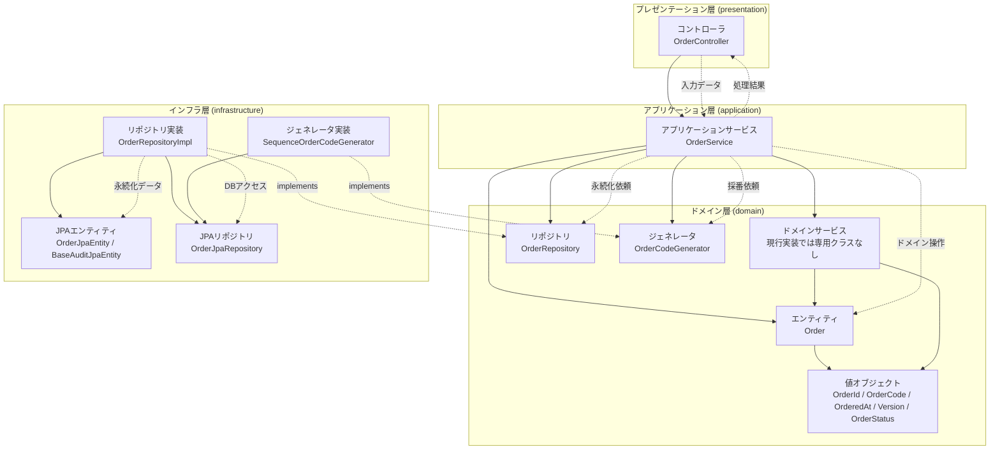

# レイヤー構成概要

本書は `phone-order-api` の各レイヤーに存在する主要クラス、依存関係、データフローを図で整理する。  
現行の Java 実装と OpenAPI 生成物を基準とする。

---

## 概要

- 各レイヤーにどのようなクラスがあるかを俯瞰できるようにする
- 依存方向とデータの流れを 1 つの概要図で把握できるようにする
- 実装変更時に、どこへ責務を置くべきかを判断しやすくする

---

## 内容

### 方針

- 図は現行実装に存在するクラスだけで構成する
- 特定ユースケースではなく、レイヤ構成全体の概要を表す
- 詳細説明は各レイヤー資料へ委譲し、本書は全体像に集中する

### ルール

- プレゼンテーション層はコントローラを中心に HTTP 入出力、例外変換、ログフィルタを持つ
- アプリケーション層は `OrderService` にユースケースを集約する
- ドメイン層はエンティティ、値オブジェクト、ドメインサービス、リポジトリ、ジェネレータを持つ
- インフラ層はリポジトリ実装、ジェネレータ実装、JPA エンティティ、JPA リポジトリを持つ
- 依存方向は `presentation -> application -> domain` を基本とし、`infrastructure` は `domain` 境界を実装する

### 図の見方

- 実線 `-->` は通常の依存または呼び出し関係を表す
- 点線 `-.->` は interface の実装関係や、補足的なデータの受け渡し関係を表す

### イメージ図

#### レイヤー構成概要

### 手順

1. 新しいクラスを追加した場合は、どのレイヤーに属するかを先に判断する
2. 既存クラスとの依存関係が内向きか確認する
3. データフローが変わる変更を行った場合は、本書の図も更新する

---

## 関連資料

- `アーキテクチャ概要.md`
- `依存ルール.md`
- `パッケージ構成.md`
- `レイヤー設計/プレゼンテーション層.md`
- `レイヤー設計/アプリケーション層.md`
- `レイヤー設計/ドメイン層.md`
- `レイヤー設計/インフラ層.md`
